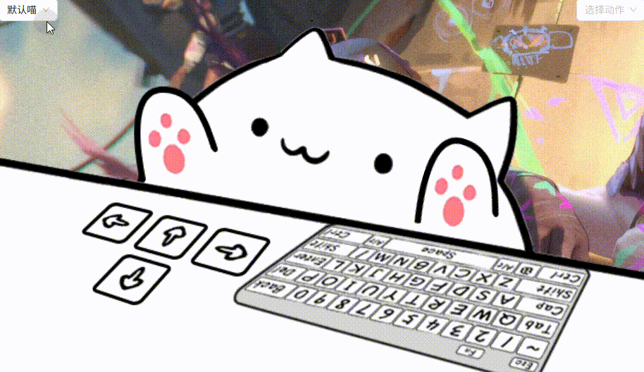
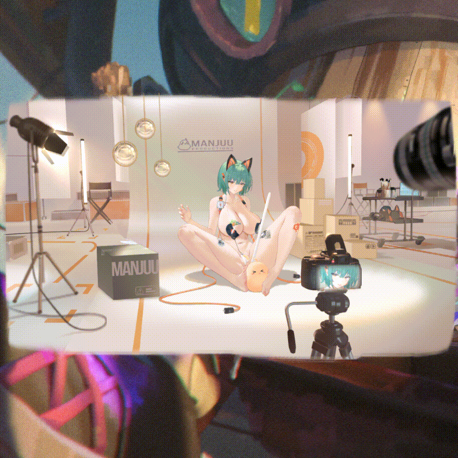
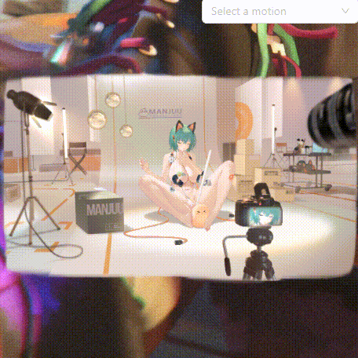

# BongoCat Next

<div align="center">

**[English](README.md)** | **[简体中文](README_zh.md)**


**A modern desktop pet application featuring cute Live2D cats to accompany your coding journey**

[](LICENSE)
[](package.json)
[](https://tauri.app/)
[](https://nextjs.org/)

</div>

## 📸 Preview

<div align="center">

### Standard Mode (Mouse Interaction)


*Interactive animations with motions and expressions*


### Keyboard Mode


*The cat responds to your keyboard input with adorable animations!*


### Cat Girl Mode (Naximofu)


*Advanced Live2D model with rich animations*


</div>

## ✨ Features

### 🎯 Core Features
- 🐱 **Desktop Pet Display** - Adorable Live2D cat models
- ⌨️ **Keyboard Response** - Real-time keyboard input detection with corresponding animations
- 🖱️ **Mouse Interaction** - Click animations and mouse tracking
- 🎭 **Motion System** - Interactive motion selector with various animations
- 😃 **Expression System** - Dynamic facial expressions control
- 🎨 **Live2D Models** - Support for custom Live2D model files
- 🖼️ **Transparent Window** - Seamless desktop integration with full transparency

### ⚙️ Customization
- 🎛️ **Opacity Control** - Adjust cat transparency (0-100%)
- 🔄 **Mirror Mode** - Horizontal flip for different usage preferences
- 📌 **Always on Top** - Stay above all other windows
- 👻 **Click Through** - Optional mouse click penetration
- 🗂️ **Model Switching** - Switch between multiple Live2D models
- 🎮 **Selector Visibility** - Toggle motion and expression selectors

### 🛠️ System Integration
- 🎪 **System Tray** - Convenient tray menu for quick access
- 🔧 **Global Hotkeys** - System-wide keyboard shortcuts
- 📱 **Multi-window** - Independent main and settings windows
- 🌐 **Cross-platform** - Windows, macOS, and Linux support

## 🛠️ Tech Stack

### Frontend
- **[Next.js 15](https://nextjs.org/)** - Modern React framework with SSG support
- **[TypeScript](https://www.typescriptlang.org/)** - Type-safe JavaScript
- **[Tailwind CSS](https://tailwindcss.com/)** - Utility-first CSS framework
- **[Ant Design](https://ant.design/)** - Enterprise UI components
- **[Zustand](https://github.com/pmndrs/zustand)** - Lightweight state management
- **[PIXI.js v6](https://pixijs.com/)** - High-performance 2D rendering
- **[pixi-live2d-display](https://github.com/guansss/pixi-live2d-display)** - Live2D model rendering

### Backend
- **[Tauri 2](https://tauri.app/)** - Lightweight cross-platform desktop framework
- **[Rust](https://www.rust-lang.org/)** - Systems programming language
- **[rdev](https://github.com/Narsil/rdev)** - Cross-platform device event listening
- **[tauri-plugin-*](https://github.com/tauri-apps/plugins-workspace)** - Rich Tauri plugin ecosystem

## 📦 Installation

### Pre-built Releases
Download from [Releases](https://github.com/liwenka1/bongo-cat-next/releases) page:

- **Windows**: `.msi` installer
- **macOS**: `.dmg` disk image (Intel & Apple Silicon)
- **Linux**: `.deb` / `.rpm` / `.AppImage`

### Development Setup

#### Requirements
- **Node.js** 18.0.0 or higher
- **Rust** 1.70.0 or higher
- **pnpm** 8.0.0 or higher

#### Quick Start

```bash
# Clone the repository
git clone https://github.com/liwenka1/bongo-cat-next.git
cd bongo-cat-next

# Install dependencies
pnpm install

# Start development server
pnpm dev

# In another terminal, start Tauri dev mode
pnpm tauri dev
```

#### Build

```bash
# Build frontend static files
pnpm build

# Build Tauri application
pnpm tauri build
```

## 🏗️ Project Structure

```
bongo-cat-next/
├── 📁 src/                     # Next.js frontend source
│   ├── 📁 app/                # App Router pages
│   │   ├── 📄 page.tsx        # Main window page
│   │   └── 📄 layout.tsx      # Root layout
│   ├── 📁 components/         # React components
│   │   ├── 📄 cat-viewer.tsx          # Cat rendering component
│   │   ├── 📄 motion-selector.tsx     # Motion selection UI
│   │   ├── 📄 expression-selector.tsx # Expression selection UI
│   │   └── 📄 keyboard-visualization.tsx
│   ├── 📁 hooks/              # Custom hooks
│   │   ├── 📁 live2d/         # Live2D system hooks
│   │   │   ├── 📄 _useCore.ts         # Core Live2D management
│   │   │   ├── 📄 _useModelLoader.ts  # Model loading
│   │   │   ├── 📄 _useMotionPlayer.ts # Motion & expression control
│   │   │   └── 📄 _useMouseEvents.ts  # Mouse interaction
│   │   ├── 📄 use-live2d-system.ts    # Main Live2D system
│   │   ├── 📄 use-keyboard.ts         # Keyboard events
│   │   ├── 📄 use-tray.ts             # System tray
│   │   └── 📄 use-shared-menu.ts      # Context menu
│   ├── 📁 stores/             # Zustand state management
│   │   ├── 📄 cat-store.ts            # Cat state & settings
│   │   └── 📄 model-store.ts          # Model management
│   ├── 📁 types/              # TypeScript definitions
│   │   ├── 📄 live2d.ts              # Live2D types
│   │   └── 📄 device.ts              # Device event types
│   └── 📁 utils/              # Utility functions
│       └── 📄 live2d.ts              # Live2D implementation
├── 📁 src-tauri/              # Tauri Rust backend
│   ├── 📁 src/
│   │   ├── 📄 main.rs         # Main entry
│   │   ├── 📄 lib.rs          # Library entry
│   │   └── 📁 core/           # Core functionality
│   │       └── 📄 device.rs   # Device monitoring
│   ├── 📁 assets/             # Static assets
│   │   ├── 📁 models/         # Live2D model files
│   │   │   ├── 📁 standard/   # Standard cat model
│   │   │   ├── 📁 keyboard/   # Keyboard responsive model
│   │   │   └── 📁 naximofu_2/ # Advanced cat girl model
│   │   └── 📄 tray.png        # Tray icon
│   └── 📄 tauri.conf.json     # Tauri configuration
├── 📁 public/                 # Static files
│   └── 📁 img/                # Demo GIFs
└── 📄 package.json            # Node.js configuration
```

## ⚡ Performance

- **Lightweight** - Based on Tauri 2, installer size < 20MB
- **Low Resource Usage** - Memory usage < 50MB, CPU usage < 1%
- **Native Performance** - Rust backend provides native-level performance
- **Fast Startup** - Application startup time < 2 seconds
- **Responsive** - Input event response latency < 10ms

## 📋 Usage

### Basic Operations
1. **Launch** - Double-click to run, cat appears on desktop
2. **Drag** - Left-click and drag to move the cat anywhere
3. **Right-click Menu** - Right-click on cat for feature menu
4. **System Tray** - Click tray icon for quick access
5. **Motion Control** - Use the motion selector to play animations
6. **Expression Control** - Use the expression selector to change facial expressions

### Keyboard Shortcuts
- `Ctrl + Alt + H` - Show/Hide cat
- `Ctrl + Alt + S` - Open settings
- `Ctrl + Alt + Q` - Quit application

### Configuration
Settings are saved in:
- **Windows**: `%APPDATA%/BongoCat Next/`
- **macOS**: `~/Library/Application Support/BongoCat Next/`
- **Linux**: `~/.config/BongoCat Next/`

## 🤝 Contributing

We welcome all forms of contributions!

### Development
1. **Fork** this repository
2. **Create** feature branch: `git checkout -b feature/AmazingFeature`
3. **Commit** changes: `git commit -m 'Add some AmazingFeature'`
4. **Push** to branch: `git push origin feature/AmazingFeature`
5. **Create** Pull Request

### Commit Convention
Follow [Conventional Commits](https://www.conventionalcommits.org/):
- `feat:` New features
- `fix:` Bug fixes
- `docs:` Documentation updates
- `style:` Code formatting
- `refactor:` Code refactoring
- `test:` Testing related
- `chore:` Build process or auxiliary tools

## 📄 License

This project is licensed under [MIT License](LICENSE).

## 🙏 Acknowledgments

- Thanks to [ayangweb](https://github.com/ayangweb) for the original [BongoCat](https://github.com/ayangweb/BongoCat) project inspiration
- Thanks to [Tauri](https://tauri.app/) team for the excellent framework
- Thanks to [Live2D](https://www.live2d.com/) Inc. for technical support
- Thanks to all developers contributing to the open source community

## 📞 Contact

- **GitHub Issues**: [Submit Issues](https://github.com/liwenka1/bongo-cat-next/issues)
- **Discussions**: [Join Discussions](https://github.com/liwenka1/bongo-cat-next/discussions)

---

<div align="center">

**If this project helps you, please give it a ⭐ Star!**

</div>
