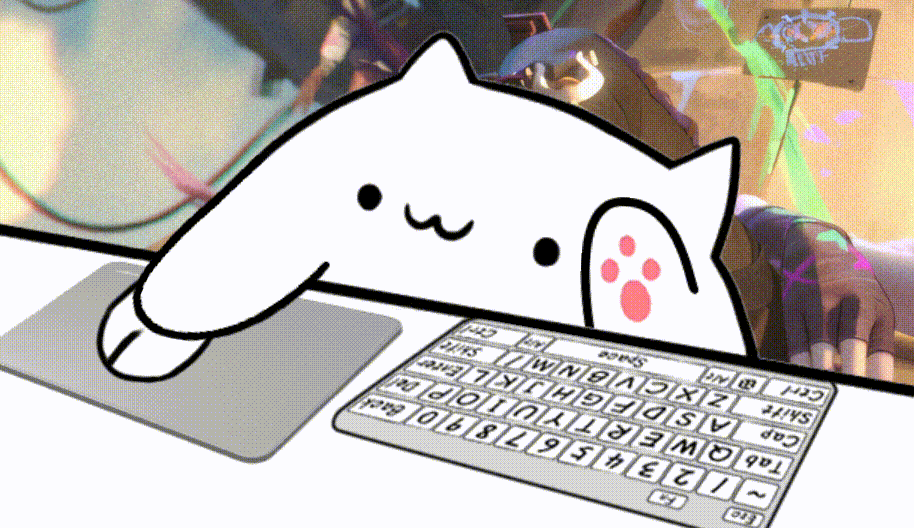
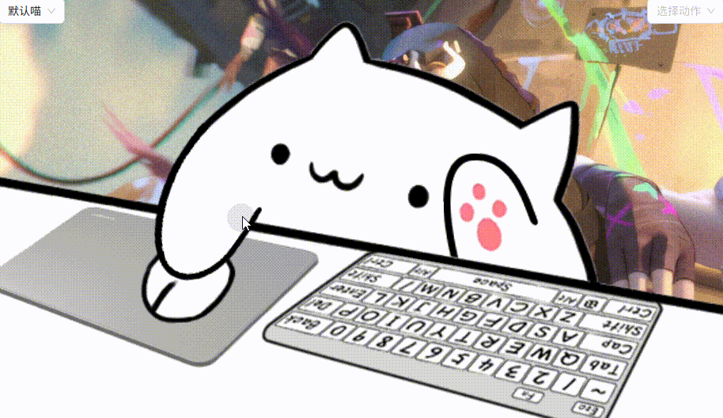
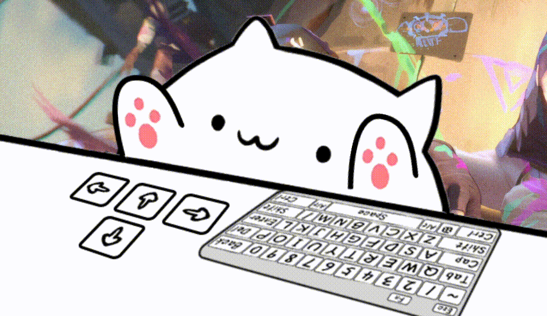

# BongoCat Next

<div align="center">

**[English](README.md)** | **[简体中文](README_zh.md)**


**A modern desktop pet application featuring cute Live2D cats to accompany your coding journey**

[](LICENSE)
[](package.json)
[](https://tauri.app/)
[](https://nextjs.org/)

</div>

## 📸 Preview

<div align="center">

### Standard Mode (Mouse Interaction)



_Interactive animations with motions and expressions_



### Keyboard Mode



_The cat responds to your keyboard input with adorable animations!_


</div>

## ✨ Features

### 🎯 Core Features

- 🐱 **Desktop Pet Display** - Adorable Live2D cat models
- ⌨️ **Keyboard Response** - Real-time keyboard input detection with corresponding animations
- 🖱️ **Mouse Interaction** - Click animations and mouse tracking
- 🎭 **Motion System** - Interactive motion selector with various animations
- 😃 **Expression System** - Dynamic facial expressions control
- 🎨 **Live2D Models** - Support for custom Live2D model files
- 🖼️ **Transparent Window** - Seamless desktop integration with full transparency

### ⚙️ Customization

- 🎛️ **Opacity Control** - Adjust cat transparency (0-100%)
- 🔄 **Mirror Mode** - Horizontal flip for different usage preferences
- 📌 **Always on Top** - Stay above all other windows
- 👻 **Click Through** - Optional mouse click penetration
- 🗂️ **Model Switching** - Switch between multiple Live2D models
- 🎮 **Selector Visibility** - Toggle motion and expression selectors

### 🛠️ System Integration

- 🎪 **System Tray** - Convenient tray menu for quick access
- 🔧 **Global Hotkeys** - System-wide keyboard shortcuts
- 📱 **Multi-window** - Independent main and settings windows
- 🌐 **Cross-platform** - Windows, macOS, and Linux support
- 🌍 **Internationalization** - Multi-language support (English/Chinese) with automatic language detection

## 📦 Installation

### Pre-built Releases

Download from [Releases](https://github.com/liwenka1/bongo-cat-next/releases) page:

- **Windows**: `.msi` installer
- **macOS**: `.dmg` disk image (Intel & Apple Silicon)
- **Linux**: `.deb` / `.rpm` / `.AppImage`

### Development Setup

#### Requirements

- **Node.js** 18.0.0 or higher
- **Rust** 1.70.0 or higher
- **pnpm** 8.0.0 or higher

#### Quick Start

```bash
# Clone the repository
git clone https://github.com/liwenka1/bongo-cat-next.git
cd bongo-cat-next

# Install dependencies
pnpm install

# Start development server
pnpm dev

# In another terminal, start Tauri dev mode
pnpm tauri dev
```

#### Build

```bash
# Build frontend static files
pnpm build

# Build Tauri application
pnpm tauri build
```

#### Build

```bash
# Build frontend static files
pnpm build

# Build Tauri application
pnpm tauri build
```

## ⚡ Performance

- **Lightweight** - Based on Tauri 2, installer size < 20MB
- **Low Resource Usage** - Memory usage < 50MB, CPU usage < 1%
- **Native Performance** - Rust backend provides native-level performance
- **Fast Startup** - Application startup time < 2 seconds
- **Responsive** - Keyboard and mouse event response latency < 10ms

## 📋 Usage

### Basic Operations

1. **Launch** - Double-click to run, cat appears on desktop
2. **Drag** - Left-click and drag to move the cat anywhere
3. **Right-click Menu** - Right-click on cat for feature menu
4. **System Tray** - Click tray icon for quick access
5. **Motion Control** - Use the motion selector to play animations
6. **Expression Control** - Use the expression selector to change facial expressions

### Keyboard Shortcuts

- `Ctrl + Alt + H` - Show/Hide cat
- `Ctrl + Alt + S` - Open settings
- `Ctrl + Alt + Q` - Quit application

### Configuration

Settings are saved in:

- **Windows**: `%APPDATA%/BongoCat Next/`
- **macOS**: `~/Library/Application Support/BongoCat Next/`
- **Linux**: `~/.config/BongoCat Next/`

## 🤝 Contributing

We welcome all forms of contributions!

### Development

1. **Fork** this repository
2. **Create** feature branch: `git checkout -b feature/AmazingFeature`
3. **Commit** changes: `git commit -m 'Add some AmazingFeature'`
4. **Push** to branch: `git push origin feature/AmazingFeature`
5. **Create** Pull Request

### Commit Convention

Follow [Conventional Commits](https://www.conventionalcommits.org/):

- `feat:` New features
- `fix:` Bug fixes
- `docs:` Documentation updates
- `style:` Code formatting
- `refactor:` Code refactoring
- `test:` Testing related
- `chore:` Build process or auxiliary tools

## 📄 License

This project is licensed under [MIT License](LICENSE).

## 🙏 Acknowledgments

- Thanks to [BongoCat](https://github.com/ayangweb/BongoCat) project inspiration
- Thanks to [Tauri](https://tauri.app/) team for the excellent framework
- Thanks to [Live2D](https://www.live2d.com/) Inc. for technical support
- Thanks to [Live2d-model](https://github.com/Eikanya/Live2d-model) for providing the Live2D models
- Thanks to all developers contributing to the open source community
