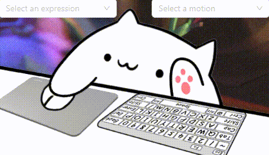
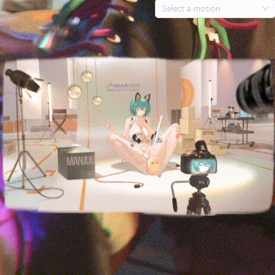

# BongoCat Next

<div align="center">

**[English](README.md)** | **[简体中文](README_zh.md)**


**一个现代化的桌面宠物应用，让可爱的猫咪陪伴你的编程时光**

[](LICENSE)
[](package.json)
[](https://tauri.app/)
[](https://nextjs.org/)

</div>

## 📸 应用预览

<div align="center">

### 标准模式（鼠标交互）


*支持动作和表情的互动动画*



### 键盘模式


*猫咪会根据你的键盘操作做出可爱的反应！*


### 猫娘模式（Naximofu）


*高级Live2D模型，丰富的动画效果*



</div>

## ✨ 功能特性

### 🎯 核心功能
- 🐱 **桌面宠物显示** - 可爱的Live2D猫咪模型
- ⌨️ **键盘响应** - 实时响应键盘按键，猫咪会做出对应动作
- 🖱️ **鼠标交互** - 鼠标点击动画和鼠标跟踪
- 🎭 **动作系统** - 交互式动作选择器，多种动画效果
- 😃 **表情系统** - 动态面部表情控制
- 🎨 **Live2D模型** - 支持自定义Live2D模型文件
- 🖼️ **透明窗口** - 完全透明的窗口背景，无缝融入桌面

### ⚙️ 个性化设置
- 🎛️ **透明度调节** - 自由调整猫咪透明度 (0-100%)
- 🔄 **镜像模式** - 左右镜像显示，适应不同使用习惯
- 📌 **置顶显示** - 总在最前端显示，不会被其他窗口遮挡
- 👻 **点击穿透** - 可选择是否穿透鼠标点击
- 🗂️ **模型切换** - 支持多种Live2D模型，随时切换
- 🎮 **选择器显隐** - 可切换动作和表情选择器的显示

### 🛠️ 系统集成
- 🎪 **系统托盘** - 便捷的托盘菜单，快速访问功能
- 🔧 **热键支持** - 全局快捷键控制
- 📱 **多窗口管理** - 主窗口和设置窗口独立管理
- 🌐 **跨平台** - 支持 Windows、macOS、Linux
- 🌍 **国际化支持** - 多语言支持（中英文），自动语言检测

## 🛠️ 技术栈

### 前端技术
- **[Next.js 15](https://nextjs.org/)** - 现代React框架，支持SSG静态导出
- **[TypeScript](https://www.typescriptlang.org/)** - 类型安全的JavaScript
- **[Tailwind CSS](https://tailwindcss.com/)** - 实用优先的CSS框架
- **[Ant Design](https://ant.design/)** - 企业级UI组件库
- **[Zustand](https://github.com/pmndrs/zustand)** - 轻量级状态管理
- **[PIXI.js v6](https://pixijs.com/)** - 高性能2D渲染引擎
- **[pixi-live2d-display](https://github.com/guansss/pixi-live2d-display)** - Live2D模型显示
- **[react-i18next](https://react.i18next.com/)** - 国际化框架

### 后端技术
- **[Tauri 2](https://tauri.app/)** - 轻量级跨平台桌面应用框架
- **[Rust](https://www.rust-lang.org/)** - 系统级编程语言
- **[rdev](https://github.com/Narsil/rdev)** - 跨平台设备事件监听
- **[tauri-plugin-*](https://github.com/tauri-apps/plugins-workspace)** - 丰富的Tauri插件生态

## 📦 安装使用

### 预编译版本
从 [Releases](https://github.com/liwenka1/bongo-cat-next/releases) 页面下载对应平台的安装包：

- **Windows**: `.msi` 安装包
- **macOS**: `.dmg` 磁盘镜像 (支持Intel和Apple Silicon)
- **Linux**: `.deb` / `.rpm` / `.AppImage`

### 开发环境

#### 环境要求
- **Node.js** 18.0.0 或更高版本
- **Rust** 1.70.0 或更高版本
- **pnpm** 8.0.0 或更高版本

#### 快速开始

```bash
# 克隆项目
git clone https://github.com/liwenka1/bongo-cat-next.git
cd bongo-cat-next

# 安装依赖
pnpm install

# 启动开发服务器
pnpm dev

# 在另一个终端中启动Tauri开发模式
pnpm tauri dev
```

#### 构建打包

```bash
# 构建前端静态文件
pnpm build

# 构建Tauri应用
pnpm tauri build
```

## 🏗️ 项目结构

```
bongo-cat-next/
├── 📁 src/                     # Next.js 前端源码
│   ├── 📁 app/                # App Router 页面
│   │   ├── 📄 page.tsx        # 主窗口页面
│   │   └── 📄 layout.tsx      # 根布局
│   ├── 📁 components/         # React 组件
│   │   ├── 📄 cat-viewer.tsx          # 猫咪渲染组件
│   │   ├── 📄 motion-selector.tsx     # 动作选择界面
│   │   ├── 📄 expression-selector.tsx # 表情选择界面
│   │   └── 📄 keyboard-visualization.tsx
│   ├── 📁 hooks/              # 自定义 Hooks
│   │   ├── 📁 live2d/         # Live2D 系统钩子
│   │   │   ├── 📄 _useCore.ts         # Live2D 核心管理
│   │   │   ├── 📄 _useModelLoader.ts  # 模型加载
│   │   │   ├── 📄 _useMotionPlayer.ts # 动作与表情控制
│   │   │   └── 📄 _useMouseEvents.ts  # 鼠标交互
│   │   ├── 📄 use-live2d-system.ts    # Live2D 主系统
│   │   ├── 📄 use-keyboard.ts         # 键盘事件
│   │   ├── 📄 use-tray.ts             # 系统托盘
│   │   └── 📄 use-shared-menu.ts      # 上下文菜单
│   ├── 📁 i18n/               # 国际化
│   │   └── 📄 index.ts                # i18n 配置
│   ├── 📁 locales/            # 语言资源
│   │   ├── 📁 en-US/          # 英文翻译
│   │   └── 📁 zh-CN/          # 中文翻译
│   ├── 📁 stores/             # Zustand 状态管理
│   │   ├── 📄 cat-store.ts            # 猫咪状态和设置
│   │   └── 📄 model-store.ts          # 模型管理
│   ├── 📁 types/              # TypeScript 类型定义
│   │   ├── 📄 live2d.ts              # Live2D 类型
│   │   └── 📄 device.ts              # 设备事件类型
│   └── 📁 utils/              # 工具函数
│       └── 📄 live2d.ts              # Live2D 实现
├── 📁 src-tauri/              # Tauri Rust 后端
│   ├── 📁 src/
│   │   ├── 📄 main.rs         # 主入口
│   │   ├── 📄 lib.rs          # 库入口
│   │   └── 📁 core/           # 核心功能
│   │       └── 📄 device.rs   # 设备监听
│   ├── 📁 assets/             # 静态资源
│   │   ├── 📁 models/         # Live2D 模型文件
│   │   │   ├── 📁 standard/   # 标准猫咪模型
│   │   │   ├── 📁 keyboard/   # 键盘响应模型
│   │   │   └── 📁 naximofu_2/ # 高级猫娘模型
│   │   └── 📄 tray.png        # 托盘图标
│   └── 📄 tauri.conf.json     # Tauri 应用配置
├── 📁 public/                 # 公共静态文件
│   └── 📁 img/                # 演示动图
└── 📄 package.json            # Node.js 项目配置
```

## ⚡ 性能特点

- **轻量级** - 基于Tauri 2，安装包大小 < 20MB
- **低资源占用** - 内存使用 < 50MB，CPU占用 < 1%
- **原生性能** - Rust后端提供原生级别的性能
- **快速启动** - 应用启动时间 < 2秒
- **响应迅速** - 键鼠事件响应延迟 < 10ms

## 📋 使用说明

### 基本操作
1. **启动应用** - 双击运行，猫咪出现在桌面
2. **拖拽移动** - 鼠标左键拖拽猫咪到任意位置
3. **右键菜单** - 右键点击猫咪打开功能菜单
4. **系统托盘** - 点击托盘图标快速访问功能
5. **动作控制** - 使用动作选择器播放各种动画
6. **表情控制** - 使用表情选择器切换面部表情

### 快捷键
- `Ctrl + Alt + H` - 显示/隐藏猫咪
- `Ctrl + Alt + S` - 打开设置页面
- `Ctrl + Alt + Q` - 退出应用

### 配置文件
应用设置保存在以下位置：
- **Windows**: `%APPDATA%/BongoCat Next/`
- **macOS**: `~/Library/Application Support/BongoCat Next/`
- **Linux**: `~/.config/BongoCat Next/`

## 🤝 贡献指南

我们欢迎所有形式的贡献！

### 开发贡献
1. **Fork** 本仓库
2. **创建** 功能分支: `git checkout -b feature/AmazingFeature`
3. **提交** 更改: `git commit -m 'Add some AmazingFeature'`
4. **推送** 到分支: `git push origin feature/AmazingFeature`
5. **创建** Pull Request

### 提交规范
遵循 [Conventional Commits](https://www.conventionalcommits.org/) 规范：
- `feat:` 新功能
- `fix:` 修复bug
- `docs:` 文档更新
- `style:` 代码格式调整
- `refactor:` 代码重构
- `test:` 测试相关
- `chore:` 构建过程或辅助工具的变动

## 📄 许可证

本项目采用 [MIT License](LICENSE) 许可证。

## 🙏 致谢

- 感谢 [BongoCat](https://github.com/ayangweb/BongoCat) 项目提供的灵感
- 感谢 [Tauri](https://tauri.app/) 团队提供的优秀框架
- 感谢 [Live2D](https://www.live2d.com/) 公司的技术支持
- 感谢 [Live2d-model](https://github.com/Eikanya/Live2d-model) 仓库提供的Live2D模型
- 感谢所有为开源社区做出贡献的开发者们

## 📞 联系我

- **GitHub Issues**: [提交问题](https://github.com/liwenka1/bongo-cat-next/issues)
- **Discussions**: [参与讨论](https://github.com/liwenka1/bongo-cat-next/discussions)

---

<div align="center">

**如果这个项目对你有帮助，请给我一个 ⭐ Star！**

</div>
